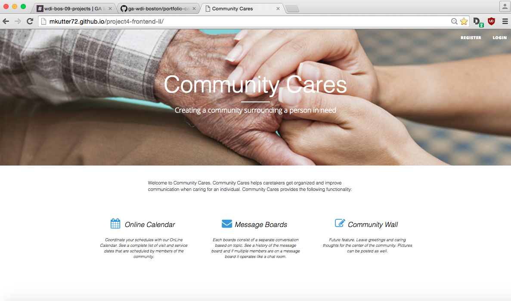
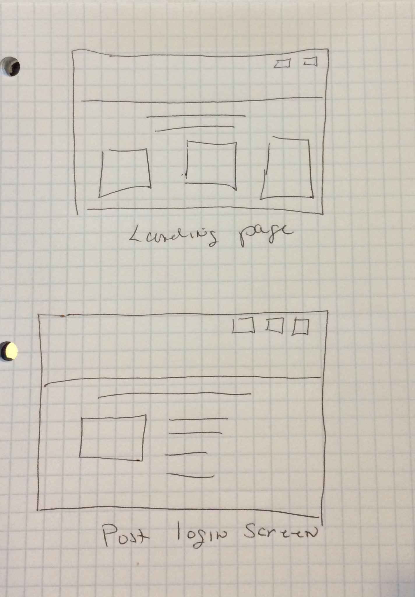
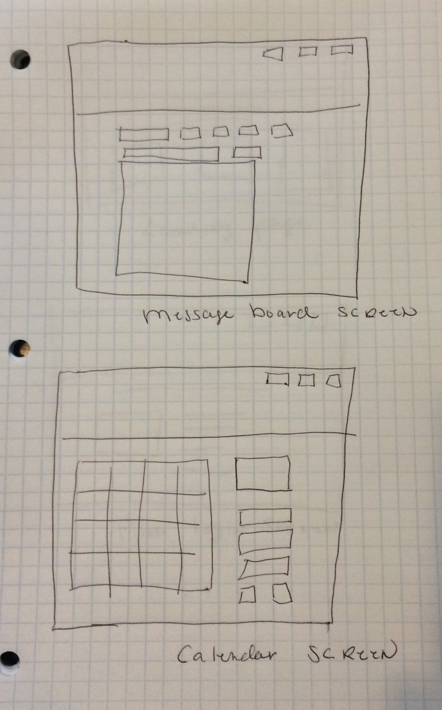

# README For Community Cares Website - Project 4
This README file is for general information and details on the front end of the Community Cares project.  For the backend README file
see: https://github.com/mkutter72/project4-backend/blob/master/README.md

## Users Stories:
### General Creator Stories
* As a user I want to create an account
* As a user I want to login with a secure login
* As a user I want to be able to create a message board
* As a user I want to list existing message boards and display content
* As a user I want to be able to add messages to a message board
* As a user I want to see new messages appear if another user is online and posting messages
* As a user I want to have access to an online calendar
* As a user I want to add events to the calendar
* As a user I want to remove event from the calendar
* As a user I want to see new events appear if another user is online and creating events
* As a user I want to see events be removed if another user is online and removing events

##Additional Stories for Phase II
* As a user I want to be able to create a new community cares portal
* As a user I want to view the online wall
* As a user I want to be able to add new enteries to the wall, including text and photos

##Screen Shot of completed App

##Wireframe Diagrams

##Explanation of Technologies Used
I selected Mongo as my database because of it's flexibly.   I have still have major pieces of work I want to do and like the fact that I don't have to make all my design decisions up front.   I selected socket.io because if it's ease of use (coding along with the demo) and that it has been very popular on GitHub.

##Unsolved Problems/Major Hurdles
I am having intermitant problems with saving my conversations in the database.   Maybe an interaction wit socket.io and mongo

##Installation Instructions
N/A

##General Approach/Workflow Planning
* Define user stories
* Create Wireframe for Website
* Analysis of user stores for determining what data collections are present in the database
* Consider what queries will be needed to retrieve and operate on data tables
* Create JSON for a survey and return it from a simple server to work on HTML/JS frontend development
* Create database and models and test with mongodb
* manually populate database
* implement retrieval routes and test with postman
* Implement routes and test with postman
* Create Website with function controls but not final organization
* Create JavaScript for DOM manipulation and AJAX on the front-end
* Integrate front and back ends
* Make Website look nice
* Work on Phase II tasks

## Technologies Used
HTLM, CSS, Boostrap, socket.io,
JavaScript,  JQuery, AJAX, JSON,
Node.js, Express, Mongodb, Mongoose

##URL to Project 4 hosted in gh-pages
http://mkutter72.github.io/project4-frontend-II/

